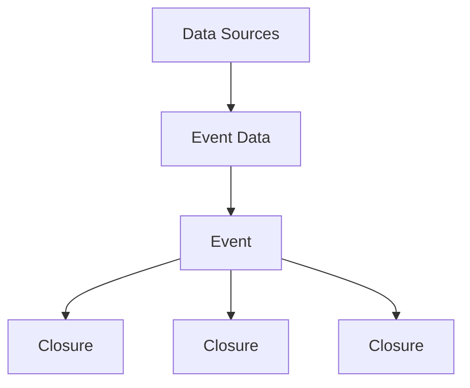
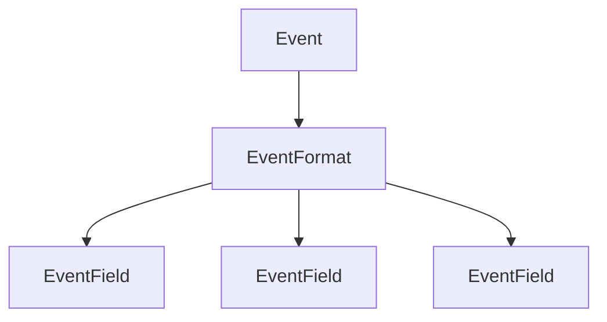
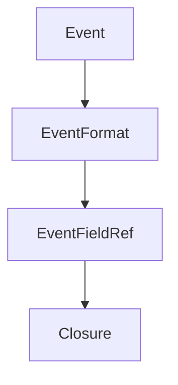
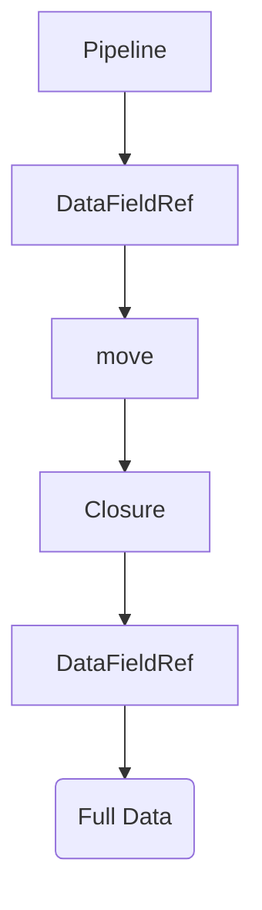

# Quick access to per-event details and closures

Events make up the vast majority of data that is consumed by pipelines. They also allow extension points for others to build
upon. This is made possible by events having a list of closures that run when data is available for that event. The closures
typically copy and move the format details they require from the event. This allows extremely fast decoding of event data.

## High level architecture

## Decoding

Each Event has an EventFormat that is accessible via format(). EventFormat then has one or more fields that indicate details
about a part of the data the event contains. The details include the name and type of data as well as the offset it is located.
Event data is almost always a set of many fields, each having a different offset within that data. 

In order to use the fields in closures, they must be moved into the closure. To do this efficiently we have an EventFieldRef.
The EventFieldRef is really a usize, so it is very small and easily moved around. It points to the index of the EventField
within the Event. In the closure it can be used to quickly fetch data for that field without having to linearly scan for a
name or other details.

## Closures

Event closures are passed context to aid in decoding and other operations. The closure includes the full data of the event,
the EventFormat of the Event, and finally the Event only data. The EventFieldRef is used to decode the Event only data. The
full data is made up of the original data as given to a pipeline. For example, when perf_events is used the full data is
the actual perf_event ring buffer data. This data includes not only the actual event, but also other supporting data, such as
the process ID the event came from, or the stack trace when the event fired.

Attributes from the full data are accessed via a DataFieldRef in much the same way an EventFieldRef is. The main difference is
that DataFieldRefs are typically [shared](SHARING.md) objects. This allows a caller to get a DataFieldRef from a pipeline, and
instead of an index, the underlying values of the data offset will be changed by the pipeline without the closure having to be
aware of this. This is extremely useful to allow simple closures for consumers, while handling the complexity of a given data
source, such as perf_events.

